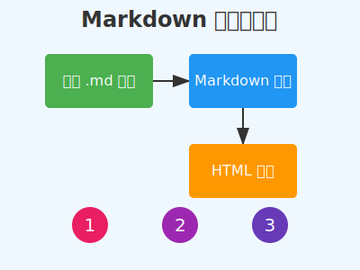
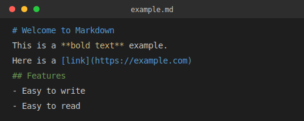
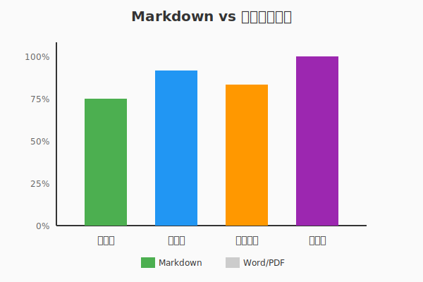

# Markdown 完整使用指南

> 本指南包含了 Markdown 的基础语法和高级用法，以及图片、链接等常用功能的详细说明。

## 目录

- [1. 基础语法](#1-基础语法)
  - [1.1 标题](#11-标题)
  - [1.2 段落和换行](#12-段落和换行)
  - [1.3 强调和加粗](#13-强调和加粗)
- [2. 列表](#2-列表)
- [3. 链接](#3-链接)
- [4. 图片](#4-图片)
- [5. 代码](#5-代码)
- [6. 表格](#6-表格)
- [7. 引用](#7-引用)
- [8. 分割线](#8-分割线)
- [9. 任务列表](#9-任务列表)

---

## 1. 基础语法

### 1.1 标题

Markdown 支持 6 级标题，使用 `#` 号表示：

```markdown
# 一级标题
## 二级标题
### 三级标题
#### 四级标题
##### 五级标题
###### 六级标题
```

效果展示：

# 一级标题示例
## 二级标题示例
### 三级标题示例

### 1.2 段落和换行

段落之间用空行分隔。

这是第一个段落。这里的文字会自动换行，但在同一段落内。

这是第二个段落。如果需要强制换行，可以在行末加两个空格
然后换行，就像这样。

### 1.3 强调和加粗

```markdown
*斜体文字* 或 _斜体文字_
**粗体文字** 或 __粗体文字__
***粗斜体*** 或 ___粗斜体___
~~删除线文字~~
```

效果展示：
- *这是斜体文字*
- **这是粗体文字**
- ***这是粗斜体文字***
- ~~这是删除线文字~~

---

## 2. 列表

### 无序列表

使用 `-`、`*` 或 `+` 创建无序列表：

```markdown
- 第一项
- 第二项
  - 嵌套项目
  - 另一个嵌套项目
- 第三项
```

效果展示：
- 苹果
- 香蕉
  - 青香蕉
  - 熟香蕉
- 橙子

### 有序列表

使用数字加点创建有序列表：

```markdown
1. 第一步
2. 第二步
3. 第三步
```

效果展示：
1. 打开编辑器
2. 编写 Markdown
3. 保存文件

---

## 3. 链接

### 基础链接语法

```markdown
[链接文字](URL)
[链接文字](URL "可选标题")
```

### 链接示例

- [访问 GitHub](https://github.com)
- [Google 搜索](https://www.google.com "世界最大的搜索引擎")
- [百度](https://www.baidu.com "中文搜索引擎")

### 引用式链接

```markdown
[链接文字][引用标识]

[引用标识]: URL "可选标题"
```

示例：
我经常使用 [Google][1] 和 [GitHub][2] 进行开发工作。

[1]: https://www.google.com "Google 搜索"
[2]: https://github.com "GitHub"

### 自动链接

直接使用尖括号包围 URL：
- <https://www.example.com>
- <example@email.com>

---

## 4. 图片

### 基础图片语法

```markdown


```

### 图片示例

#### 本地图片引用（实际存储在项目中）

##### Markdown Logo


##### GitHub Mark


##### SVG 图表示例

###### 工作流程图


###### 代码编辑器示例


###### 对比图表


#### 网络图片


#### 带链接的图片
点击下面的图片可以访问 GitHub：
[](https://github.com)

### 控制图片大小

Markdown 原生不支持调整图片大小，但可以使用 HTML：

```html


```

效果：


### 本地图片引用语法

```markdown


```

实际效果已在上方展示。本项目的 images 文件夹中包含了以下示例图片：
- `markdown-logo.png` - Markdown 官方 Logo
- `github-mark.png` - GitHub Logo
- `example-diagram.svg` - 工作流程图（SVG 格式）
- `code-example.svg` - 代码编辑器示例（SVG 格式）
- `comparison-chart.svg` - 对比图表（SVG 格式）

---

## 5. 代码

### 行内代码

使用反引号包围代码：`console.log('Hello World')`

### 代码块

使用三个反引号创建代码块，可以指定语言：

```javascript
function greeting(name) {
  console.log(`Hello, ${name}!`);
  return `Welcome to Markdown Guide`;
}
```

```python
def calculate_sum(numbers):
    """计算列表中所有数字的和"""
    return sum(numbers)

# 示例
result = calculate_sum([1, 2, 3, 4, 5])
print(f"Sum: {result}")
```

```bash
# 终端命令示例
npm install markdown-it
git clone https://github.com/user/repo.git
cd repo && npm start
```

---

## 6. 表格

使用管道符 `|` 和连字符 `-` 创建表格：

```markdown
| 列1 | 列2 | 列3 |
|-----|-----|-----|
| 内容1 | 内容2 | 内容3 |
| 内容4 | 内容5 | 内容6 |
```

### 对齐方式

```markdown
| 左对齐 | 居中对齐 | 右对齐 |
|:------|:-------:|------:|
| 左边   | 中间     | 右边   |
| Left  | Center  | Right |
```

效果展示：

| 语言 | 类型 | 流行度 |
|:-----|:----:|------:|
| JavaScript | 动态 | ⭐⭐⭐⭐⭐ |
| Python | 动态 | ⭐⭐⭐⭐⭐ |
| Java | 静态 | ⭐⭐⭐⭐ |
| Go | 静态 | ⭐⭐⭐ |

---

## 7. 引用

使用 `>` 创建引用块：

> 这是一个引用块。
> 可以包含多行内容。

> 引用也可以嵌套
>> 这是嵌套的引用
>>> 更深层的嵌套

> **引用中可以使用其他 Markdown 语法**
> - 列表项
> - 另一个列表项
>
> 包含 `代码` 的引用

---

## 8. 分割线

使用三个或更多的连字符、星号或下划线创建分割线：

```markdown
---
***
___
```

效果如上下所示：

---

## 9. 任务列表

使用 `- [ ]` 和 `- [x]` 创建任务列表：

```markdown
- [x] 完成项目初始化
- [x] 编写文档
- [ ] 添加测试
- [ ] 发布版本
```

效果展示：

- [x] 学习 Markdown 基础语法
- [x] 掌握链接和图片插入
- [ ] 练习表格创建
- [ ] 探索高级功能

---

## 10. 高级技巧

### HTML 支持

Markdown 支持直接嵌入 HTML：

<div style="background-color: #f0f0f0; padding: 10px; border-radius: 5px;">
  <p style="color: #333;">这是一个使用 HTML 样式的段落。</p>
  <strong style="color: red;">红色加粗文字</strong>
</div>

### 转义字符

使用反斜杠 `\` 转义特殊字符：

```markdown
\*不是斜体\*
\[不是链接\]
\# 不是标题
```

效果：\*不是斜体\*

### 脚注

创建脚注[^1]的方法很简单[^2]。

[^1]: 这是第一个脚注的内容
[^2]: 这是第二个脚注的内容

### 锚点链接

可以创建页内跳转链接：
- [跳转到标题部分](#11-标题)
- [跳转到图片部分](#4-图片)
- [返回顶部](#markdown-完整使用指南)

---

## 实用资源

### 在线编辑器
- [Markdown Live Preview](https://markdownlivepreview.com/)
- [Dillinger](https://dillinger.io/)
- [StackEdit](https://stackedit.io/)

### 学习资源
- [CommonMark 规范](https://commonmark.org/)
- [GitHub Flavored Markdown](https://github.github.com/gfm/)
- [Markdown Guide](https://www.markdownguide.org/)

### 常用图片资源
- [Unsplash](https://unsplash.com/) - 免费高质量图片
- [Placeholder.com](https://placeholder.com/) - 占位图生成
- [Lorem Picsum](https://picsum.photos/) - 随机图片

---

## 总结

Markdown 是一种简单而强大的标记语言，适合用于：
- 📝 技术文档编写
- 📚 博客文章创作
- 📋 项目 README 文件
- 💡 笔记和知识管理
- 🎯 任务和待办事项

掌握这些基础语法后，你就能够高效地创建格式良好的文档了！

---

*最后更新：2024年*