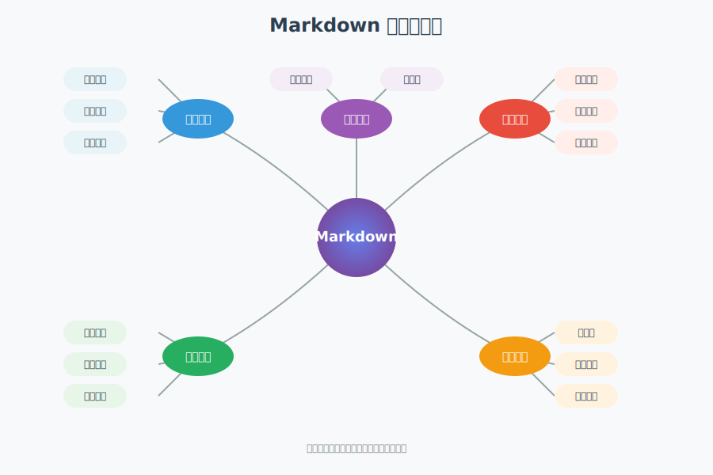

# SVG 图形创建能力展示

> 作为 AI，我可以直接生成 SVG（可缩放矢量图形）代码，创建各种类型的图表、图形和可视化内容。

## 📊 我能创建的 SVG 内容类型

### 1. 基础图形元素
- **几何形状**：矩形、圆形、椭圆、线条、多边形、路径
- **文本元素**：各种字体、大小、颜色的文字
- **颜色填充**：纯色、渐变（线性/径向）
- **描边样式**：实线、虚线、点线等

### 2. 数据可视化图表

#### 柱状图/条形图
```svg
<svg width="400" height="300" xmlns="http://www.w3.org/2000/svg">
  <!-- 可以创建各种统计图表 -->
</svg>
```

#### 饼图/环形图
- 数据占比展示
- 带标签的扇形图
- 动态分离效果

#### 折线图/曲线图
- 趋势展示
- 多数据系列对比
- 带网格和坐标轴

#### 散点图/气泡图
- 数据分布可视化
- 相关性展示

### 3. 流程图和示意图

#### 工作流程图
- 带箭头的流程连接
- 决策节点
- 并行/串行流程

#### 组织架构图
- 层级关系展示
- 树状结构

#### 思维导图
- 中心辐射结构
- 分支展开

### 4. 信息图表设计

#### 仪表盘元素
- 进度条
- 环形进度
- 仪表指针

#### 时间轴
- 里程碑标记
- 事件序列

### 5. 图标和装饰元素
- 简单图标设计
- 背景图案
- 装饰边框

## 🎨 SVG 的独特优势

1. **无限缩放**：矢量图形，任意缩放不失真
2. **文件小巧**：文本格式，体积小
3. **可编辑性**：可以直接修改代码调整
4. **支持交互**：可添加 CSS 动画和 JavaScript 交互
5. **SEO 友好**：文本内容可被搜索引擎索引
6. **跨平台兼容**：所有现代浏览器都支持

## 🚀 实际示例展示

### 已创建的 SVG 示例文件

#### 1. 饼图 - 技术栈使用占比


#### 2. 折线图 - 网站访问量趋势


#### 3. 复杂流程图 - 用户登录验证


#### 4. 数据仪表盘 - 业务监控


#### 5. 思维导图 - Markdown 学习路径


## 💡 我的 SVG 创建能力特点

### 技术实现
1. **纯代码生成**：我直接编写 SVG XML 代码，不依赖任何图形软件
2. **精确控制**：可以精确控制每个元素的位置、大小、颜色
3. **数学计算**：能够计算复杂的路径、角度、坐标（如饼图扇形）
4. **样式丰富**：支持渐变、阴影、滤镜等高级效果

### 应用场景
- **技术文档配图**：流程图、架构图、示意图
- **数据报告**：各类统计图表、仪表盘
- **教学材料**：概念图、思维导图
- **产品展示**：信息图、对比图
- **界面原型**：简单的 UI 元素和布局

### 优势
- **即时生成**：不需要打开任何设计软件
- **可定制性**：根据需求调整任何细节
- **版本控制友好**：SVG 是文本格式，适合 Git 管理
- **响应式**：可以轻松适配不同屏幕尺寸
- **无需外部资源**：所有图形都是自包含的

### 限制
- **复杂插画**：无法创建照片级真实感的图像
- **动画复杂度**：虽然支持基础动画，但复杂交互需要额外 JS
- **艺术创作**：更适合技术图表而非艺术作品

## 📝 如何使用

如果你需要任何类型的图表或示意图，只需描述你的需求：
1. 图表类型（饼图、柱状图、流程图等）
2. 数据内容
3. 颜色偏好
4. 尺寸要求

我就能立即为你生成对应的 SVG 文件！